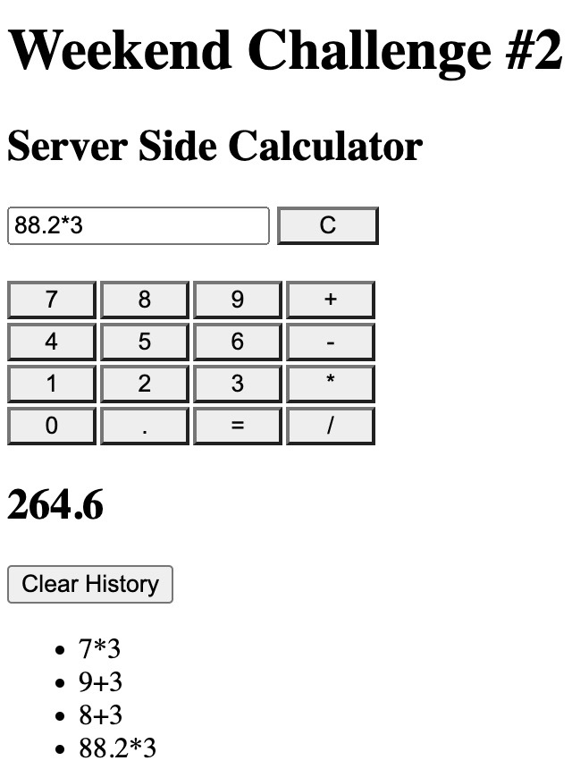

# Server Side Calculator

## Description

_Duration: 2 Day Sprint_

Server Side Calculator helps the user do simple math from anywhere in the world. Users can do addition, subtraction, multiplication and division. Simply use your keyboard or the provided user interface to enter 2 numbers (can be decimal, at the current state of the program it's not possible to start a number with . ie .45 would need to be 0.45) and 1 operator ONLY. So input format would be [number][operator][number], ie 5.6+7.99. The user will then have to click the [=] button to get the result. The result will be displayed below the numeric buttons, and a list of previous calculations will be appended as more calculations are performed. The most recent calculation equation will be appended to the bottom of the list.
The input box can be cleared of its content by clicking the [C] button.

## Screen Shot

Server Side Calculator.

Server Side Calculator with inputs.

### Prerequisites

Link to software that is required to develop this website.

- [javascript](https://www.javascript.com/)
- [css]
- [html]
- [jquery]
- [git](https://git-scm.com/)
- [github](https://github.com/)
- [node](https://nodejs.org/en/)
- [body-parser](https://www.npmjs.com/package/body-parser)

## Installation

1. Go to https://github.com/tormodsletteboe/weekend-jquery-server-calculator
2. Fork that repo into your own github account.
3. Copy the ssh address
4. In your terminal navigate to a folder you want to clone into.
5. Run `git clone [ssh address]` in your terminal
6. cd into the cloned folder and run `code .` in your terminal to open the project in vscode.
7. Make sure 'express' and 'body-parser' is installed. To do so in your terminal run 'npm install'. Npm will look at your dependecies and install needed libraries. If this does not work try 'npm install express' and npm install body-parser'.
8. To start the server run 'node server/server.js' in termial, or if 'npm init -y' was run, the user can add a start command in the script part of the package.json" 
9. To start server run 'npm start' or 'node server/server.js'
10. If it started, terminal will display 'server is up on port 3000'
11. Open a web-browser and go to 'localhost:3000'
12. You can now enjoy doing calculations likd a pro from "anywhere" in the world'.

## Usage

1. Type in first number then the operator (i.e +,-,/ or *) followed by the second number
2. Click the = button, to see the result.
3. The most recent calculation will be appended to a list of previous calculations.
4. User can click the [C] button at any time to clear the user interface inputs.
5. Clear does not clear/empty the list of previous calculations.

## Built With

javascript, css, html, jquery, git and github.com

## Acknowledgement
Thanks to [Prime Digital Academy](www.primeacademy.io) who equipped and helped me to make this application a reality. (Edan Schwartz, Liz Kerber, Adam Lee for help on the regex part and https://github.com/ziishaned/learn-regex to help understand regex.

## Support
If you have suggestions or issues, please email me at [tormod.slettebo@gmail.com]

